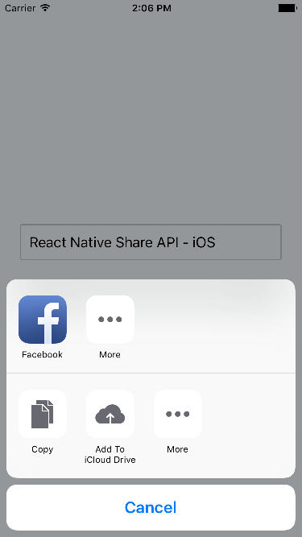

# React Native Share API
A simple tool for share message and file to other apps.



# How to install react-native-share
1. If you are using react-native >= 0.60 you just need to do a simple:
```
$ yarn add react-native-share
```
Or if are using npm:
```
$ npm i react-native-share --save
```

2. After that, if you use iOS then you should install  the dependencies bu running this command: 
```
$ npx pod-install 
```
OR
```
$cd ios && pod install
```
After that, you should be able to use the library on both Platforms, iOS and Android.

# How to use react-native-share
simply import:

```js 
import Share from "react-native-share";
```

# Let's start with simple example
copy the following code and paste it in your editor, then try to run it:
```js
import { Share, View, Button } from 'react-native';

const ShareExample = () => {
  const onShare = async () => {
    try {
      const result = await Share.share({
        message:
          'React Native | A framework for building native apps using React',
      });
      if (result.action === Share.sharedAction) {
        if (result.activityType) {
          // shared with activity type of result.activityType
        } else {
          // shared
        }
      } else if (result.action === Share.dismissedAction) {
        // dismissed
      }
    } catch (error) {
      alert(error.message);
    }
  };
  return (
    <View style={{ marginTop: 50 }}>
      <Button onPress={onShare} title="Share" />
    </View>
  );
};

export default ShareExample;
```
# Let's explain some methods: 
1. share()
```js
static share(content, options)
```
Open a dialog to share text content.

In iOS, returns a Promise which will be invoked with an object containing ```action``` and ```activityType```. If the user dismissed the dialog, the Promise will still be resolved with action being ```Share.dismissedAction``` and all the other keys being undefined. Note that some share options will not appear or work on the iOS simulator.

In Android, returns a Promise which will always be resolved with action being ```Share.sharedAction```.

<h3>Content</h3>

- ```message``` - a message to share
<h5>iOS</h5>

- ```url``` - an URL to share
At least one of URL and message is required.

<h5>Android</h5>

- ```title``` - title of the message

<h3>Options</h3>

<h5>iOS</h5>

- ```subject``` - a subject to share via email 
- ```excludedActivityTypes```
- ```tintColor```

<h5>Android</h5>

- ```dialogTitle```

2. sharedAction
```js
static sharedAction
```
The content was successfully shared.

3. dismissedAction
```js
static dismissedAction
```
iOS Only. The dialog has been dismissed.

# References
- [NPM](https://www.npmjs.com/package/react-native-share)
- [React-Native-Tutorial] (https://reactnative.dev/docs/share)